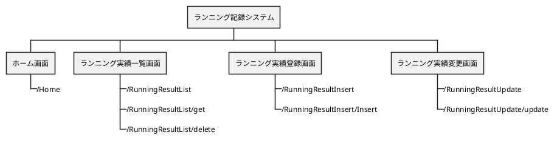

# 詳細設計書

## 1.目的
ランニング記録システムの機能を詳細に記述すること。
各画面の処理及びデータの流れを図や表で示す。
***
## 2.変更履歴

***
## 3.ユースケースマップ


## 4. エンドポイント一覧
本システムにおけるエンドポイント一覧を以下に示す。

| 機能                     | URL                           | メソッド | レスポンス | 説明                                                       |
| -----------------------  | ---------------------------  | -------- | ---------- | ----------------------------------------------- |
| メインメニュー            | /Home                         | get      | html       | メインメニューを表示する。                      |
| 一覧表示                  | /RunningResultlist            | get      | html       | ランニング実績一覧画面の初期表示。                          |
| 一覧データ取得            | /RunningResultlist/get        | get      | json       | ランニング実績データを取得する。                            |
| 一覧データ削除            | /RunningResultlist/Delete        | delete      | json       | ランニング実績データを削除する。                            |
| 登録画面表示   | /RunningResultInsert        | get      | html       | ランニング実績登録画面の表示。                              |
| データ登録               | /RunningResultInsert/create | post     | json       | ランニング実績データ登録処理。                              |
| 変更画面表示   | /RunningResultUpdate           | get      | html       | ランニング実績変更画面初期表示。<br/>ランニング実績データを取得する。   |
| データ変更              | /RunningResultUpdate/update    | put      | json       | ランニング実績データ変更処理。                              |

##5. エンドポイント詳細

本システムにおけるエンドポイント一覧を以下に示す。

## 5.1.ホーム画面 

### 5.1.1. ホーム画面 表示[/Home]

#### 5.1.1.1. シーケンス

```puml
actor ユーザー as User
boundary Endpoint as Con
control Service as Ser
entity Repository as Repo
database DB as DB

group メインメニュー表示
  autonumber 1

    User -> Con: URLアクセス
    Con --> User: ホーム画面

end
```

#### 5.1.1.2. リクエストパラメータ

- なし

#### 5.1.1.3. レスポンスパラメータ

| 和名 | 英名 | 型     | 備考            |
| ---- | ---- | ------ | --------------- |
| -    | -    | String | "home" 固定 |

#### 5.1.1.4. データマッピング

- なし

#### 5.1.1.5. 特記事項

- なし

## 5.2. ランニング実績一覧画面

### 5.2.1. 一覧表示[/RunningResultlist]

#### 5.2.1.1. シーケンス

```puml
actor ユーザー as User
boundary Endpoint as Con
control Service as Ser
entity Repository as Repo
database DB as DB

group 一覧表示
  autonumber 1
    User -> Con: 「ランニング実績一覧画面」ボタン押下
    Con -> Ser: 処理要求
    note over Repo
    一覧データ取得処理
    end note
    Ser -> Con: 結果返却
    Con --> User: ランニング実績一覧画面表示
end
```

#### 5.2.1.2. リクエストパラメータ

- なし

#### 5.2.1.3. レスポンスパラメータ

- なし

#### 5.2.1.4. データマッピング

- なし

#### 5.2.1.5. 特記事項

- なし

### 5.2.2. 一覧データ取得[/RunningResultlist/get]

#### 5.2.2.1. シーケンス

```puml
actor ユーザー as User
boundary Endpoint as Con
control Service as Ser
entity Repository as Repo
database DB as DB

group データ取得
  autonumber 1
    Ser -> Repo: 処理要求
    Repo -> DB: SQL発行
    DB -> Repo: SQL実行結果返却
    Repo -> Ser: 結果返却
end
```

#### 5.2.2.2. リクエストパラメータ

- なし

#### 5.2.2.3. レスポンスパラメータ

| 和名          | 英名               | 型     | 備考           |
| ------------- | ----------------- | ------ | -------------- |
| -             | -                 | String | "RunningResultlist" 固定 |
| シーケンスNo.  | noseq             | Serial | -              |
| ランニング日   | outputDay         | Date | -              |
| ランニング時間 | outputTime        | Time | -              |
| ランニング距離 | outputDistance    | Decimal | -              |
| 体重          | outputWeight      | Decimal | -              |
| 体脂肪率       | outputFat        | Decimal | -              |
| 基礎代謝       | outputMetabolism | Int | -              |

- 返却値の例

```json
{
  "noseq": "1"
  "outputDay": "2020/12/31"
  "outputTime": "00:35:20"
  "outputDistance": "5.12"
  "outputWeight": "56.6"
  "outputFat": "12.3"
  "outputMetabolism": "1446"
}
```

#### 5.2.2.4. データマッピング

- ランニング実績データ全件取得

```sql
select
  ランニング実績情報テーブル.シーケンスNo.
  ランニング実績情報テーブル.ランニング日付
  ランニング実績情報テーブル.ランニング時間
  ランニング実績情報テーブル.ランニング距離
  ランニング実績情報テーブル.体重
  ランニング実績情報テーブル.体脂肪率
  ランニング実績情報テーブル.基礎代謝
from
  ランニング実績情報テーブル
```

#### 5.2.2.5. 特記事項

- なし

### 5.2.3. 一覧データ削除[/RunningResultlist/Delete]

#### 5.2.3.1. シーケンス

```puml
actor ユーザー as User
boundary Endpoint as Con
control Service as Ser
entity Repository as Repo
database DB as DB

group データ取得
  autonumber 1
    Ser -> Repo: 処理要求
    Repo -> DB: SQL発行
    DB -> Repo: SQL実行結果返却
    Repo -> Ser: 結果返却
end
```

#### 5.2.3.2. リクエストパラメータ

| 和名          | 英名               | 型     | 備考           |
| ------------- | ----------------- | ------ | -------------- |
| シーケンスNo.  | noseq             | Serial | -              |

#### 5.2.3.3. レスポンスパラメータ

| 和名          | 英名               | 型     | 備考           |
| ------------- | ----------------- | ------ | -------------- |
| -             | -                 | String | "RunningResultlist" 固定 |
| シーケンスNo.  | noseq             | Serial | -              |
| ランニング日   | outputDay         | Date | -              |
| ランニング時間 | outputTime        | Time | -              |
| ランニング距離 | outputDistance    | Decimal | -              |
| 体重          | outputWeight      | Decimal | -              |
| 体脂肪率       | outputFat        | Decimal | -              |
| 基礎代謝       | outputMetabolism | Int | -              |

#### 5.2.3.4. データマッピング

- ランニング実績データ削除

```sql
delete from
  ランニング実績情報テーブル
where
  ランニング実績情報テーブル.シーケンスNo. = 選択行.シーケンスNo.
```

- ランニング実績データ全件取得

```sql
select
  ランニング実績情報テーブル.シーケンスNo.
  ランニング実績情報テーブル.ランニング日付
  ランニング実績情報テーブル.ランニング時間
  ランニング実績情報テーブル.ランニング距離
  ランニング実績情報テーブル.体重
  ランニング実績情報テーブル.体脂肪率
  ランニング実績情報テーブル.基礎代謝
from
  ランニング実績情報テーブル
```

#### 5.2.2.5. 特記事項

- なし


## 5.3. ランニング実績登録画面

### 5.3.1. ランニング実績登録画面表示[/RunningResultInsert]

#### 5.3.1.1. シーケンス

```puml
scale 0.8
actor ユーザー as User
boundary Endpoint as Con
control Service as Ser
entity Repository as Repo
database DB as DB

group ランニング実績データ登録
  autonumber 1

    User -> Con: 「ランニング実績登録画面」ボタン押下
    Con -> User: ランニング実績登録画面表示

end
```

#### 5.3.1.2. リクエストパラメータ

| 和名          | 英名               | 型     | 備考           |
| ------------- | ----------------- | ------ | -------------- |
| シーケンスNo.  | noseq             | Serial | -              |


#### 5.3.1.3. レスポンスパラメータ

| 和名 | 英名 | 型     | 備考               |
| ---- | ---- | ------ | ------------------ |
| -    | -    | String | "RunningResultInsert" 固定 |

#### 5.3.1.4. データマッピング

- なし

#### 5.3.1.5. 特記事項

- なし

### 5.3.2. ランニング実績データ登録[/RunningResultInsert/Insert]

#### 5.3.2.1. シーケンス

```puml
scale 0.8
actor ユーザー as User
boundary Endpoint as Con
control Service as Ser
entity Repository as Repo
database DB as DB

group ランニング実績データ登録
  autonumber 1

    User -> User: 情報入力
    User -> Con: 「登録」ボタン押下
    group 登録成功
    autonumber 4
    Con -> Ser: 処理要求
    Ser -> Repo: 処理要求
    Repo -> DB: SQL発行
    DB -> Repo: SQL実行結果返却
    Repo -> Ser: 結果返却
    note over Repo
    一覧データ取得と同様の処理
    end note
    Ser -> Con: 結果返却
    Con --> User: ランニング実績一覧画面表示
    end
    group 登録失敗(入力必須文字がない等)
    autonumber 4
    Con -> Con: 要求失敗
    Con -> User: エラーメッセージ表示
    end
    group 登録失敗(キー制約違反等)
    autonumber 4
    Con -> Ser: 処理要求
    Ser -> Repo: 処理要求
    Repo -> DB: SQL発行
    DB -> Repo: 登録失敗
    Repo -> Ser: 結果返却
    Ser -> Con: 結果返却
    Con --> User: エラーメッセージ表示
    end

end
```

#### 5.3.2.2. リクエストパラメータ

| 和名          | 英名               | 型     | 備考           |
| ------------- | ----------------- | ------ | -------------- |
| ランニング日   | outputDay         | Date | -              |
| ランニング時間 | outputTime        | Time | -              |
| ランニング距離 | outputDistance    | Decimal | -              |
| 体重          | outputWeight      | Decimal | -              |
| 体脂肪率       | outputFat        | Decimal | -              |
| 基礎代謝       | outputMetabolism | Int | -              |

#### 5.3.2.3. レスポンスパラメータ

- 登録成功時

| 和名 | 英名 | 型     | 備考            |
| ---- | ---- | ------ | --------------- |
| -    | -    | String | "RunningResultlist" 固定 |

- 登録失敗時

| 和名 | 英名 | 型     | 備考               |
| ---- | ---- | ------ | ------------------ |
| -    | -    | String | "RunningResultInsert" 固定 |

#### 5.3.2.4. データマッピング

- ランニング実績データ登録

```sql
insert into ランニング実績情報テーブル('ランニング日付','ランニング時間','ランニング距離','体重','体脂肪率','基礎代謝')
values('ランニング日付','ランニング時間','ランニング距離','体重','体脂肪率','基礎代謝')
```

#### 5.3.2.5. 特記事項

- 一覧画面で選択した行のデータを初期表示する。
- 入力ルール
  - ランニング日付はカレンダーより選択する。
  - ランニング時間は[hh:mm:dd]形式で入力する。
  - ランニング距離、体重は[整数部3桁、小数部2桁]で入力する
  - 体脂肪率は[整数部2桁、小数部2桁]で入力する
  - 基礎代謝は[整数部4桁]で入力する
- 必須入力欄を入力せずに変更ボタンを押した場合、エラーメッセージを表示する。
- キー制約違反などが起きた場合、エラーメッセージを表示する。

## 5.4. ランニング実績変更画面

### 5.4.1. ランニング実績変更画面表示[/RunningResultUpdate]

#### 5.4.1.1. シーケンス

```puml
scale 0.8
actor ユーザー as User
boundary Endpoint as Con
control Service as Ser
entity Repository as Repo
database DB as DB

group ランニング実績変更画面表示
  autonumber 1

    User -> Con: 「ランニング実績変更画面へ」ボタン押下
    Con -> Ser: 処理要求
    note over Repo
    一覧データ取得と同様の処理
    end note
    Ser -> Con: 結果返却
    Con -> User: ランニング実績一覧画面表示

end
```

#### 5.4.1.2. リクエストパラメータ

| 和名          | 英名               | 型     | 備考           |
| ------------- | ----------------- | ------ | -------------- |
| シーケンスNo.  | noseq             | Serial | -              |

#### 5.4.1.3. レスポンスパラメータ

| 和名 | 英名 | 型     | 備考           |
| ---- | ---- | ------ | -------------- |
| -    | -    | String | "RunningResultlist" 固定 |

#### 5.4.1.4. データマッピング

#### 5.4.1.5. 特記事項

### 5.4.2. ランニング実績データ変更[/RunningResultUpdate/update]

#### 5.4.2.1. シーケンス

```puml
scale 0.8
actor ユーザー as User
boundary Endpoint as Con
control Service as Ser
entity Repository as Repo
database DB as DB

group ランニング実績データ変更
  autonumber 1

    User -> User: 情報入力
    User -> Con: 「変更」ボタン押下
    group 登録成功
    autonumber 4
    Con -> Ser: 処理要求
    Ser -> Repo: 処理要求
    Repo -> DB: SQL発行
    DB -> Repo: SQL実行結果返却
    Repo -> Ser: 結果返却
    note over Repo
    一覧データ取得と同様の処理
    end note
    Ser -> Con: 結果返却
    Con --> User: 牌詳細画面表示
    end
    group 登録失敗(入力必須文字がない等)
    autonumber 4
    Con -> Con: 要求失敗
    Con -> User: エラーメッセージ表示
    end
    group 登録失敗(キー制約違反等)
    autonumber 4
    Con -> Ser: 処理要求
    Ser -> Repo: 処理要求
    Repo -> DB: SQL発行
    DB -> Repo: 登録失敗
    Repo -> Ser: 結果返却
    Ser -> Con: 結果返却
    Con --> User: エラーメッセージ表示
    end

end
```

#### 5.4.2.2. リクエストパラメータ

| 和名          | 英名               | 型     | 備考           |
| ------------- | ----------------- | ------ | -------------- |
| シーケンスNo.  | noseq             | Serial | -              |
| ランニング日   | outputDay         | Date | -              |
| ランニング時間 | outputTime        | Time | -              |
| ランニング距離 | outputDistance    | Decimal | -              |
| 体重          | outputWeight      | Decimal | -              |
| 体脂肪率       | outputFat        | Decimal | -              |
| 基礎代謝       | outputMetabolism | Int | -              |

#### 5.4.2.3. レスポンスパラメータ

- 登録成功時

| 和名 | 英名 | 型     | 備考             |
| ---- | ---- | ------ | ---------------- |
| -    | -    | String | "RunningResultlist" 固定 |

- 登録失敗時

| 和名 | 英名 | 型     | 備考            |
| ---- | ---- | ------ | --------------- |
| -    | -    | String | "RunningResultUpdate" 固定 |

#### 5.4.2.4. データマッピング

- ランニング実績データ変更

```sql
update  ランニング実績情報テーブル
set  ランニング実績情報テーブル.ランニング日付 = ランニング日付
     ランニング実績情報テーブル.ランニング時間 = ランニング時間
     ランニング実績情報テーブル.ランニング距離 = ランニング距離
     ランニング実績情報テーブル.体重 = 体重
     ランニング実績情報テーブル.体脂肪率 = 体脂肪率
     ランニング実績情報テーブル.基礎代謝 = 基礎代謝
where ランニング実績情報テーブル.シーケンスNo. = シーケンスNo.

```

#### 5.4.2.5. 特記事項
- 一覧画面で選択した行のデータを初期表示する。
- 入力ルール
  - ランニング日付はカレンダーより選択する。
  - ランニング時間は[hh:mm:dd]形式で入力する。
  - ランニング距離、体重は[整数部3桁、小数部2桁]で入力する
  - 体脂肪率は[整数部2桁、小数部2桁]で入力する
  - 基礎代謝は[整数部4桁]で入力する
- 必須入力欄を入力せずに変更ボタンを押した場合、エラーメッセージを表示する。
- キー制約違反などが起きた場合、エラーメッセージを表示する。